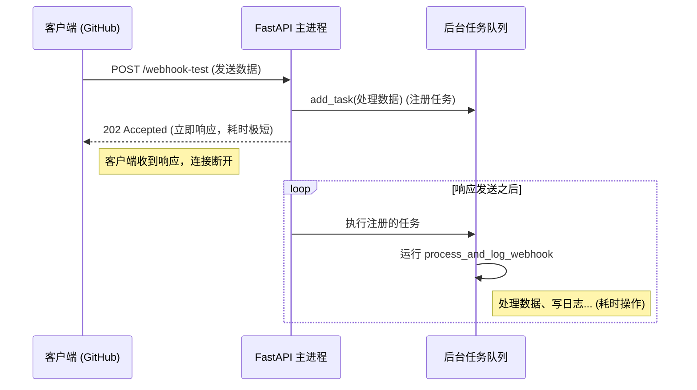

# FastAPI `BackgroundTasks` 详解与实战指南

本文档将深入解析 FastAPI 中 `BackgroundTasks` 的使用方法、工作原理，并通过我们的 `webhook_test` 接口作为实际案例进行演示。最后，我们将对比它与手动使用 Python 多线程 (`threading`) 的区别。

## 1. 什么是 `BackgroundTasks`？

在 Web 开发中，我们经常遇到这样的场景：用户发起一个请求（例如提交订单、上传文件、触发 Webhook），服务器需要执行一些耗时的操作（例如发送确认邮件、处理图像、写入日志到外部系统）。

如果我们让用户等待这些操作完成，接口响应会非常慢，用户体验极差。

FastAPI 的 `BackgroundTasks` 允许你在**返回 HTTP 响应之后**运行代码。这意味着客户端可以立即收到确认消息（如 "202 Accepted"），而服务器在后台继续默默干活。

## 2. 实战案例：Webhook 异步处理

以我们的 `py-webhook-svc` 项目中的 `/webhook-test` 接口为例。这是一个典型的 Webhook 接收端点，它的核心需求是：**快收快回**。

### 2.1 代码解析

```python:server.py
# ... imports ...

def process_and_log_webhook(headers: dict, body: dict):
    """
    这是一个后台任务函数。
    它模拟了耗时的数据处理过程（解析头信息、记录日志等）。
    """
    logger.info("--- Background webhook processing started ---")
    
    # 模拟业务逻辑
    github_event = headers.get("x-github-event")
    if github_event:
        logger.info(f"GitHub Event: {github_event}")
    
    logger.info(f"Received payload: {body}")
    logger.info("--- Background webhook processing finished ---")

@app.post("/webhook-test")
async def webhook_test(request: Request, background_tasks: BackgroundTasks, response: Response):
    """
    接收 Webhook 请求的端点。
    """
    logger.info("Webhook test endpoint called. Acknowledging request immediately.")
    
    # 1. 快速解析基础数据
    headers = dict(request.headers)
    try:
        body = await request.json()
    except Exception:
        body = {"error": "Invalid JSON"}

    # 2. 关键步骤：添加后台任务
    # 语法：background_tasks.add_task(函数名, 参数1, 参数2, ...)
    # 注意：这里只是"注册"了任务，并没有立即执行！
    background_tasks.add_task(process_and_log_webhook, headers, body)
    
    # 3. 立即返回响应
    # 此时，process_and_log_webhook 还没有运行。
    response.status_code = 202
    return {"status": "Accepted"}

# 当 return 执行完毕，FastAPI 将响应发送给客户端后，
# 它会自动触发 process_and_log_webhook 开始运行。
```

### 2.2 执行流程图解



### 2.3 关于多个任务

你可以多次调用 `add_task`：

```python
background_tasks.add_task(task_1)
background_tasks.add_task(task_2)
```

**重要特性**：默认情况下，这些任务是**串行（顺序）执行**的。
1. 发送响应。
2. 执行 `task_1`，等待它完成。
3. 执行 `task_2`，等待它完成。

---

## 3. `BackgroundTasks` vs 手动多线程 (`threading`)

你可能会问：“为什么不用 Python 标准库的 `threading.Thread` 来开一个新线程跑任务呢？”

### 3.1 对比分析

| 特性 | FastAPI `BackgroundTasks` | Python `threading.Thread` |
| :--- | :--- | :--- |
| **集成度** | **原生集成**。直接通过依赖注入使用，代码非常干净。 | **手动管理**。需要导入模块，创建线程实例，管理生命周期。 |
| **执行上下文** | 运行在当前的事件循环或线程池中（取决于任务是否为 `async`）。与 FastAPI 应用紧密绑定。 | 开启全新的系统级线程。与主应用逻辑相对分离。 |
| **资源消耗** | **低**。重用现有资源，开销很小。 | **较高**。每个线程都有独立的栈空间和系统开销。 |
| **并发性** | **串行执行**（默认）。多个后台任务会一个接一个跑。 | **真正的并发**（受 GIL 限制）。多个线程可以同时（交替）运行。 |
| **适用场景** | **轻量级、非阻塞操作**。如发邮件、写日志、简单的数据库更新。 | **CPU 密集型或极其耗时操作**。如视频转码、复杂计算，不想阻塞主线程任何时间。 |
| **错误处理** | 异常会被 FastAPI 捕获并记录（通常不会崩掉整个应用）。 | 如果线程内抛出未捕获异常，可能导致该线程静默失败，难以调试。 |

### 3.2 什么时候该用哪个？

#### ✅ 推荐使用 `BackgroundTasks` 的场景（90% 的情况）：
*   发送电子邮件通知。
*   像我们的例子一样，处理 Webhook 数据并记录日志。
*   更新缓存。
*   触发其他的 API 调用。
*   **原因**：简单、安全、足够快，不会因为开启过多线程而拖垮服务器。

#### ⚠️ 推荐使用 `threading` (或 `multiprocessing`) 的场景：
*   你需要**同时**并行处理 10 个任务，而不是一个接一个做。
*   任务非常重（例如图像处理耗时 1 分钟），你担心它会阻塞 FastAPI 的事件循环（如果它是同步函数）。
*   任务需要存活的时间比 HTTP 请求的上下文长很多。

### 3.3 代码对比

**使用 BackgroundTasks (推荐):**
```python
from fastapi import BackgroundTasks

def send_email(email: str):
    # 发送邮件逻辑
    pass

@app.post("/send-email")
async def send_notification(email: str, background_tasks: BackgroundTasks):
    background_tasks.add_task(send_email, email)
    return {"message": "Email sent"}
```

**使用 Threading (不推荐，除非必要):**
```python
import threading

def send_email(email: str):
    # 发送邮件逻辑
    pass

@app.post("/send-email")
async def send_notification(email: str):
    # 手动开启线程，不受 FastAPI 管理
    t = threading.Thread(target=send_email, args=(email,))
    t.start()
    return {"message": "Email sent"}
```

## 4. 总结

*   **机制**：`BackgroundTasks` 是 FastAPI 提供的一种在**响应返回后**执行代码的机制。
*   **优点**：代码简洁，易于测试，资源占用少。
*   **注意**：多个任务默认按顺序执行。
*   **建议**：对于大多数 Web 后端开发中的异步需求（如 Webhook 处理），它是**首选方案**。只有在遇到极端性能瓶颈或需要复杂并发时，才考虑引入 Celery 等任务队列或手动多线程。

